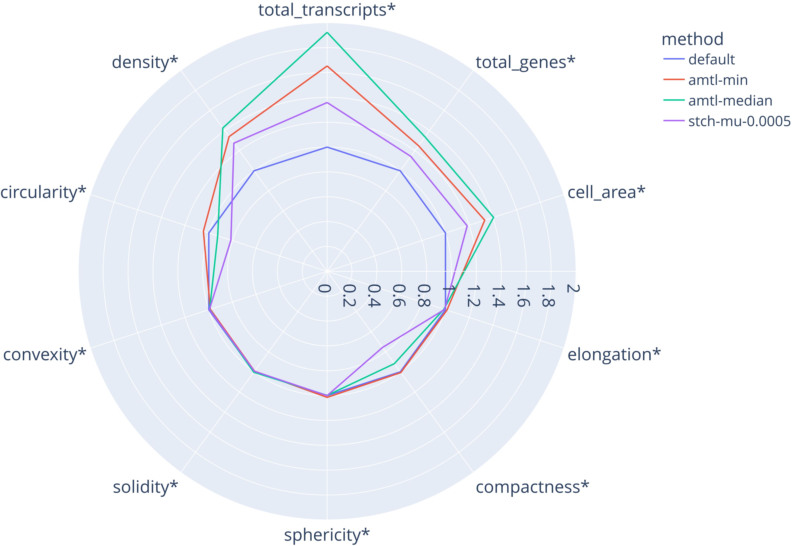

# MOSeg: Cell Segmentation Using Spatial Transcriptomic Data From The Multi-objective Optimization Perspective

## Abstract

**Motivation:** Accurate cell segmentation in spatial transcriptomics (ST) is critical but challenging due to conflicting optimization objectives. Current models like BIDCell rely on Single-Objective Optimization (SOO), which can struggle when combining multiple loss terms.

**Result:** We propose a Multi-Objective Optimization (MOO) framework for ST segmentation, integrating Aligned Multi-Task Learning (AMTL) and Smooth Tchebycheff (STCH) into BIDCell. Additionally, a new multiple assignment loss replaces the non-converging overlap loss. Results demonstrate that **AMTL provides faster, more stable training and improved gene/transcript coverage compared to scalarization methods**. This work represents the first application of MOO to ST cell segmentation, showing that gradient alignment significantly enhances performance.

**Availability:** <https://github.com/bkty1122/MOSeg>

**Contact:** <yli2@brocku.ca>

---

## Overview

**MOSeg** introduces a **Multi-Objective Optimization (MOO)** framework for cell segmentation in spatial transcriptomics. By integrating methods like **Aligned Multi-Task Learning (AMTL)** and **Smooth Tchebycheff (STCH)** scalarization into the [BIDCell](https://github.com/SydneyBioX/BIDCell) architecture, MOSeg addresses the challenges of conflicting loss functions in self-supervised learning.

Specifically, we utilize **AMTL** to dynamically align the gradients of varying loss objectives during training. This ensures that updates to one objective do not conflict with or degrade others, resolving gradient dominance issues and resulting in improved segmentation stability, faster convergence, and better handling of varied biological signals compared to traditional single-objective optimization methods.


## Visual Demonstration

The following figures illustrate the comparative performance of MOSeg against standard methods. We observe that **AMTL** consistently delivers superior stability and transcript coverage, effectively handling conflicting objectives across various learning rates.

### Normalized Spatial Measures



*Normalized spatial measures by method at baseline (losses are neither ablated nor emphasized). The default weighted sum method is used as a reference. AMTL produced cells with much larger transcript coverage, density, and cell area compared to scalarization methods, with best results for median-mode. LR = 10⁻⁷.*

### Learning Rate Exploration


*Demonstration of the difference by learning rates. Rows represent initial R = 10⁻⁵, ..., 10⁻⁹, and columns represent the three methods, next to the original DAPI nuclei images.*

## Repository Structure

This repository follows a streamlined structure. Data files should be placed in the `data/` directory as described below.

```text
.
├── bidcell/              # Core implementation of the MOSeg/BIDCell model and loss functions
├── data/                 # Dataset directory (user-provided)
├── tests/                # Unit tests for the framework
├── example_small.py      # Sample script to run a small-scale segmentation demo
├── Figure1.png           # Workflow/Overview diagram
├── lr-exploration-by-method.png # Figure demonstrating learning rate effects
└── README.md             # Project documentation
```

## Installation

1. **Clone the repository:**

   ```bash
   git clone https://github.com/bkty1122/MOSeg.git
   cd MOSeg
   ```

2. **Install dependencies:**
   It is recommended to use a virtual environment.

   ```bash
   pip install .
   ```

## Usage

A sample script is provided to demonstrate the pipeline on a small dataset/patch.

```bash
python example_small.py
```

Check `example_small.py` to see how to configure the model, load data, and run the segmentation.

## Credits

This work heavily utilizes and builds upon the **BIDCell** framework. We acknowledge and thank the authors of [BIDCell](https://github.com/SydneyBioX/BIDCell) for their open-source contribution to the community.

**Original BIDCell Repository:** [https://github.com/SydneyBioX/BIDCell](https://github.com/SydneyBioX/BIDCell)

## Citation

If you use this code or methods in your research, please cite our work:

```
@article{MOSeg2024,
  title={Cell Segmentation Using Spatial Transcriptomic Data From The Multi-objective Optimization Perspective},
  author={Garber Tara, Kwok Tszyi, Liu Ziying, Ooi Hsu Kiang, Necakov Aleksandar, Pan Youlian, Li Yifeng},
  journal={Preprint},
  year={2026},
  note={Under Review at ISMB 2026}
}
```
